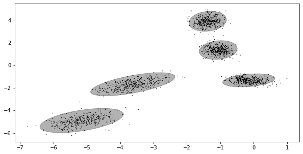

# Gaussian Mixture Model
```
Course Index: AI501
```

This is the implement of gaussian mixture model. 

## Environment 

```
Python Version: 3.6 or later
Python Packages: numpy, matplotlib, scipy
```

## Structure

```
.
├── fig/
├── data/
├── src/
│   ├── utils.py
│   └── plot.py
└── main.ipynb
```

- `fig`: result figures
- `data`: source data for this assignment
- `src`: all source code will be here
  - `utils.py`: including all functions of mixture gaussian model
  - `plot.py`: including plot function to visulize the result
- `main.ipynb`: notebook contain the test for the model and the result

## Example

Result on example dataset, with 5 clusters. 



Here is the log likelihood records during the trainning. 


